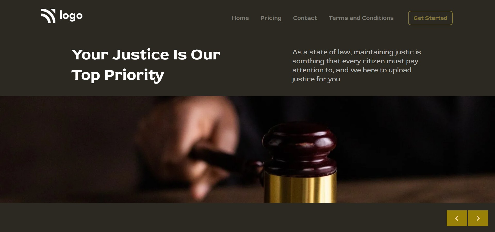

# ⭐ Project 3 : Law Home Page⭐

## 🔗Project 3 Link
https://htmlcssproject03.netlify.app/

This is a assignment given in **"JavaScript Full Stack Web Developer Bootcamp"** by **iNeuron**, built using **HTML5 and CSS3**.
 

 

## 📌 Tech Stack

&nbsp;
&nbsp;
 
 

## 📌 Overview

 

 "Template Screenshot")

## 📌 What I Learn

    👉 Structuring **HTML**  
    👉 Designing Navigation Bar  
    👉 **Positions** in CSS  
    👉 **CSS Selectors**  
    👉 Writing Comments   
    👉 Margin and Padding with Negative values  
    👉 Units like pixels, viewports,percentage  
    👉 Float,centering the text, images and div  

## Time taken to complete this project was **1.5 hr**.

## 📬 Connect With Me

- **LinkedIn** - [Pratyush Kesarwani](https://www.linkedin.com/in/pratyush-kesarwani-2b6601171/)

## 📌 Acknowledgments

- Course Instructor - [Hitesh Choudhary](https://github.com/hiteshchoudhary)
